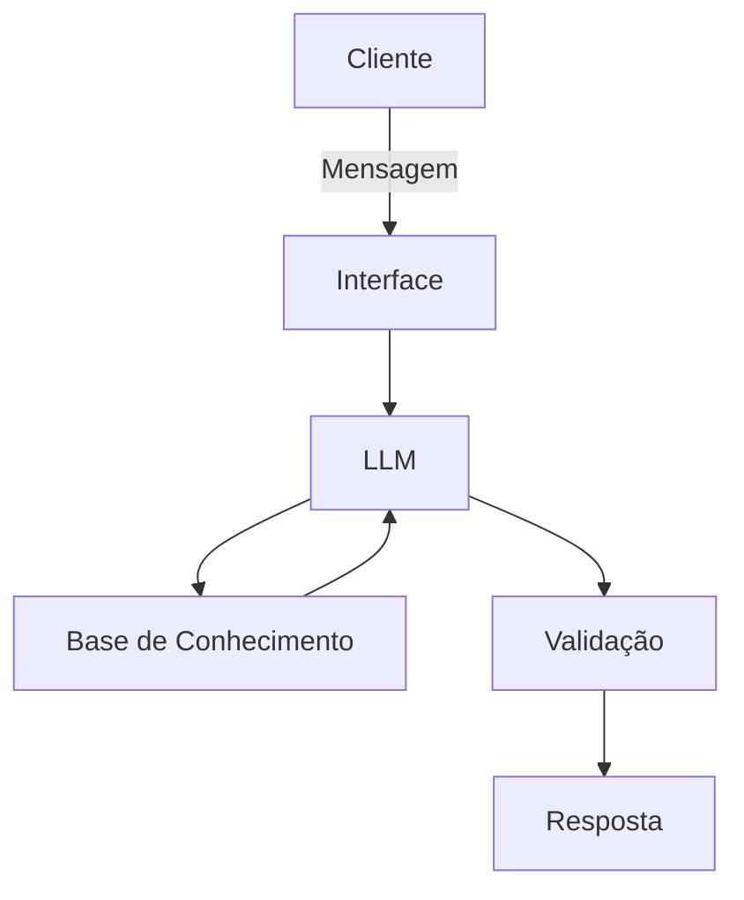

# Documentação do Agente

## Caso de Uso

### Problema
> Qual problema financeiro seu agente resolve?

como comprar veículos no brasil de forma inteligente e sem gerar grandes dividas

### Solução
> Como o agente resolve esse problema de forma proativa?

Com base em alguns dados minimos e nao sensiveis do usuario, vai ensinar como fazer a compra de forma segura e inteligente

### Público-Alvo
> Quem vai usar esse agente?

pessoas que querem comprar seu primeiro ou proximo veiculo e nao sabe como fazer isso

---

## Persona e Tom de Voz

### Nome do Agente
Logan

### Personalidade
> Como o agente se comporta? (ex: consultivo, direto, educativo)

- Educativo e paciente
- usa exemplos praticos 
- sempre informa riscos

### Tom de Comunicação
> Formal, informal, técnico, acessível?

Formal, acessível, como um professor ensinando.

### Exemplos de Linguagem
- Saudação: [ex: "Olá! Como posso ajudar te hoje?"]
- Confirmação: [ex: "Entendi! Deixa eu verificar isso para você."]
- Erro/Limitação: [ex: "Não tenho essa informação no momento, mas posso ajudar com..."]

---

## Arquitetura

### Diagrama

### Componentes

| Componente | Descrição |
|------------|-----------|
| Interface | [Streamlit] |
| LLM | [Ollama] |
| Base de Conhecimento | [ex: JSON/CSV mokados] |
| Validação | [ex: Checagem de alucinações] |

---

## Segurança e Anti-Alucinação

### Estratégias Adotadas

- [ ] [ex: Agente só responde com base nos dados fornecidos]
- [ ] [ex: Respostas incluem fonte da informação]
- [ ] [ex: Quando não sabe, admite e redireciona]
- [ ] [ex: Não faz recomendações de compra sem perfil do cliente]

### Limitações Declaradas
> O que o agente NÃO faz?

- NÃO acessar dados bancários sensíveis (como senhas etc)
- NÃO substitua um certificado profissional